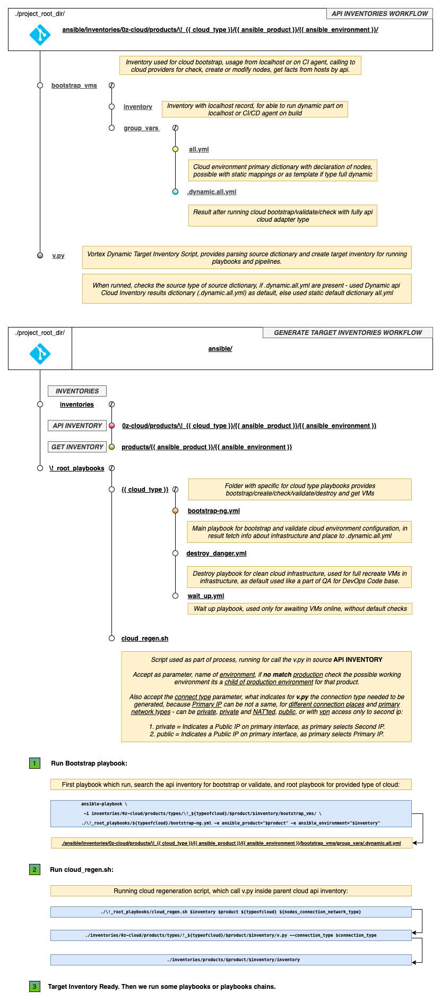

# Welcome, to Vortex Vx˜

**Release State: stable-1.6.1-h0-test**


* At ``` *.woinc.ru ``` we are place a ``` Public Demo Access Platform ``` 
  which represent our ``` Vx Live Run ``` 

* This are real ``` Lifecycle Auto Cloud ``` 

* Demo have some set of Company Public Internal ``` Products ```,
  and in public part we are show,
  as example our simple sample:
  
  - ``` Vx Zone Environment Infrastructure Subset ``` 

* Vx Repo hold and contain exmplain to each implemented as
  ``` a self Vx parts in each Vx Repository ``` 

* So, by you requests, we can be able to give to requester an a access,
  to internal tools, placed in inside of ``` Demo Infrastructure ```,
  at [special Telegram channel](https://t.me/joinchat/AAAAAFT2mIn4avUY6E0F9w).

Example run contain:

 - https://woinc.ru
 - https://teamcity.woinc.ru
 - https://gitlab.woinc.ru
 - https://www.woinc.ru
 - https://ogame.woinc.ru

## SSL Tests Results: 07.01.2021


## Repository statements:

```
* Terraform-free ansible realization of Dynamic Infrastructure development/management/deployment
* Full IaC support via Ansible Cloud API modules.
* Ready to use, just add your services and declare infrastructure.
* Simple to understand solution template provides complete CI/CD/QA.
* Multimple ways to use a many roles, zones, clusters, networks.
* K8 & Docker Swarm support - you can have a multiple clusters in one environment.
* You can have multiple virtual environments on one virtual cloud infrastructure placement.
* Easy template for build, bootstrap, develop, deploy and test your infrastructure.
* Have a TeamCity ready to import configuration with full process with simple CI/CD/QA pipeline.
* Network balancer included - keepalived, haproxy, nginx, etc
* PCI DSS Compliance initial support modules.
* Firewall zero-in inside based on Shorewall.
* Many other stuff like rabbitmq/tarantool/redis/etc clusters.
* GlusterFS as NFS shared storage.
* Provides single point in development process.
* All configurations fully generated - for local development and environments.
* You can use different CI/CD tools for use, - TeamCity, Jenkins, Gitlab-CI, etc.
* Storing builded docker images possible to different registries - gitlab, registryv2, nexus, etc.
```

### Markdown constants

    - [-] Feature which almost works fine, but need to update/bugfix/extend/refactor now.
    - [+] Feature now in dev's and planned to next major release
    - [p] Feature which are planned for future roadmap release on second major release
    - [t] Feature in Testing Branch
    - [x] Feature are implemented yet completely, like for CI/CD Pipeline, if Kubernetes as example have that flag, that describes what we can possible create cluster and deploy to it.
    - [w] Whitepaper page for feature ready to RFC, or wip state
    - [*] Feature planned to be refactored
    - [?] On RFC stage
    - [.] Pre-research and modeling. Checking able and profit after implementation.
    - [U] Urgent and most important task for complete

### Ansible Teraforma API Cloud adapters

    - [x] Baremetal (FAKE-API)
    - [*] VMware vCenter/vSphere (API)
    - [-] VMware Cloud Director (API)
    - [x] Alicloud (API)
    - [+] Amazon Web Services (API)
    - [ ] Openstack
    - [ ] Huawei Cloud
    - [ ] DigitalOcean
    - [ ] Azure
    - [ ] Apache (Citrix) CloudStack
    - [+] Google Compute Engine / Google Cloud Platform (API)
    - [ ] OpenNebula
    - [U] EVE

### Ansible Teraplatforma API Hardware adapters


### Clusters management platform flags are supported by Cluster backend type

    - [x] Docker Swarm
    - [x] Kubernetes
    - [p] Nomad
    - [.] Mesos

### Localhost providers Hyper-Visors for VMs

    - [ ] VMware Workstation/Fusion
    - [ ] Hyper-V
    - [ ] VirtualBox
    - [U] QEMU
    - [ ] Parallels
    - [ ] XEN
    - [U] EVE

### Vortex runs at OS Platforms

    - [x] Linux
    - [x] Mac OS X
    - [-] Windows
    - [-] Android

### Localhost cluster types arch in place

    - [x] Docker by docker-compose
    - [x] Vagrant
    - [p] miniKube

### Vault Storages

    - [x] Internal Contract Model Vault storage based on Ansible-Vault and simple interface for manage the zero level necessary shared logins and passwords constrains, and also product specific settings, which possibled to be shared by groups, by inventories, regions, sectors, zones, environments and placements like ACL represents are same shared pieces of security cake, - as example one command implements feature for dev[1-3] envvironments, and have only access by security violation policy interface only to part of vault where stored credentials which able perform operations only on dev environments, after task completes, teamlead as example, who have more access level, can from same commit run chain pipeline to stage environment with separated per each user credentials container level
    - [.] Vault (HashiCorp)

### Service Discovery

    - [x] Consul. Multi-DC & Multi-Zone Cloud Consul Cluster, with separated/mixed Service Discovery each Zone, Service, Network, where ACL are infinitly run with checks to reborn itself cloud warmup bootstrap, by platform levels chaining bootstraping. Mesh accounting, validation and relocation. Nginx service discovery full cover by use as upstreams service discovery endpoints which extends with prefix `*.cloud.` each frontend service mesh endpoint.
    - [.] EtcD

### Mesh Mesh Providers

    - [-] Istio
    - [x] Consul
    - [.] LinkerD
    - [.] Envoy

### Domain Name Services

    - [x] CoreDNS.

          * Primary DNS Protocol engadger which placed like frontend endpoint, -
          is are a cloud placement ` layout ` use this as shared on each ```` platform ` at ` zone `
          for rewriting, filtering, forwarding, redirection for all DNS queries.

          * Only contain rules for recursion pathing processing on each DNS query,
          knowns only about DNS zones and backend services which answers to them,
          such as like K8S Cluster DNS Public VIP Edpoint and Consul Service Discovery DNS Interface,
          who able possible to use mesh service discovery zones as parts of parent zone.


    - [x] Bind9 DNS Services Backend.

          * Is are a Stub Placement with SOA and records for primary root Domain, -
          ` consul_public_domain ` for each ` sector/zone ` where parent are ` environement ` father.
          Like redirects to (*.cloud|*.k8|*.swarm), declare itself's and static records,
          vip and service management tools endpoints, which are uses as pointer where Service Discovery,
          are is enabled for service, and static mapping where generated by Ansible Groups.

          * Provides dynamic zone extending and stacking, in geo-mesh networks detects and declare nearest endpoints of truth.

    - [-] Kubernetes DNS Vip Endpoint.

          * Used as same case like in Consul, extends domain with prefix k8 by CoreDNS DMZ Service Discovery Sector,
          and able forward DNS queries to Internal Kubernetes Cluster DNS Service Discovery,
          and represented by ` *.k8.{{ consul_public_domain }} `

    - [.] Docker Swarm DNS VIP Endpoint.

          * Internal Swarm Service Discovery DNS which are represented by ` *.swarm.{{ consul_public_domain }} `

## SERVICE NOTE BY ONE PAPER STYLE:

- [PIPELINE EXPLAIN](SERVICE_NOTE.md)
- [CONTRACT EXPLAIN](MAPPER_STRUCTURE.md)

## IaC Flow Design Compare Diagram


## Declared example standard environments/solutions architecture zone sizes for region placements

- [Vortex Minimal Layout](ansible/CI/repo_images/VortexMinimalTypeNG.png)
- [Vortex Minimal With Service Node](ansible/CI/repo_images/VortexMinimalWithServiceNodeNG.png)
- [Vortex Standard PCI DSS](ansible/CI/repo_images/VortexStandardPCING.png)

  - As default/standard ecosystem layout, in most cases for simple IT Software Solution we are use,

  

## Geo-replicated mesh cloud model map


## Mesh QA Stress Test Flow

- [Default QA Running Flow](ansible/CI/repo_images/QA_Short_flow.png)
- [Mesh QA Geo Stress Flow](ansible/CI/repo_images/QA_mesh_stress_run.png)

  - For mesh ecosystems with multiple geo-placements we able initiate Stress Test Suite to something environment from each able to accessed inventory.


## Full Working Map, stages of flow, step by step.


## Readme's links:

- [Ansible](ansible/)
- [Roles](ansible/roles/)
- [Inventories](ansible/inventories/)
- [Group Vars](ansible/group_vars/)
- [CI/CD PCI DSS Usage](ansible/CI/documentation/)
- [How to add a New Service](ansible/CI/documentation/NEW_SERVICE.md)
- [Network Maps](ansible/CI/documentation/PCI/network_maps/)
- [CI/CD Agents Debugger](ansible/!_tests/)
- [API Inventory Ansible Adapters](ansible/!_root_playbooks/)
- [In-Repository Vault Storage](ansible/.files/)

## QA Suites for templating own QA solution

- [QA Example 1 - Payment](PythonQA/history_facts/v.test.selenium.example.payment/)
- [QA Example 2 - Voting](PythonQA/history_facts/v.test.selenium.example.voting/)
- [(WIP) Warrior Way - Guidline](PythonQA/)

## Folders info must to read

- [Dockerfiles](dockerfiles/README.md)
- [Services](services/README.md)

## Two basical types of inventories

Dynamic Inventory (API INVENTORY), called 0z-cloud:

     - Zero Inventory start point of your cloud - very simple way to work.
     - Zero Inventory - cloud bootstrap and check or validate your cloud infrastructure.
     - Contain prefilled/prepared template for create the instances.
     - Availiable in two types of run - api or baremetal.
     - Contains dict and variables which you wants about infrastructure.
     - In API type used as template.

Target Inventory (GET INVENTORY), resulting inventory:

     - Result of generation the API INVENTORY, contains all needed for ansible works.
     - Placed in inventories/products/{{ ansible_product }}/{{ ansible_environment }}
     - No stored in repository.

## Principial workflow

### Directory structure for dynamic inventories, describes basical call flow


### ZeroCloud configuration flow inside and only on ansible calls



### GitFlow


### Working with virtual and cloud environments, bootstraping and managing

- Basicly, we have refactored and simplifyed reference runners, represented as `references_*.sh`
  which in one year past Beta Vortex Prototype Production Testing not looks are great, like now.
  Fow understanding how it changes solution by timeline, how works before,
  you can see a past versions of Vortex beta-version wrappers at here -
  https://github.com/itmo-eve/adam-vortex/tree/master/ansible/scripts/wrappers/init

- Generaly by layout we are have three types of environments, except localhost development type -
  `standalone`, `minimal` and `pci`.
  You can create you special one and select your options for you time.

- Firstaful, we create and bootstrap environment, now its are included in any `reference_*.sh`, in previous versions
  wrappers for that has been in separated executable wrapper files,
  you can find that old wrappers in https://github.com/itmo-eve/adam-vortex/tree/master/ansible/scripts/wrappers/init
  If your are a needed, can do like are wants be you require by Platform Product and Cloud layout,
  with flexible ways to contract your piplene chain CI/CD flow suite.

- Go to ansible folder in cloned repository, -

        ```
          cd ./ansible
        ```

  - Try run the wrapper as example, -

    ```
    ./reference_iac_stand.sh
    ```

    

  - TeamCity or other CI/CD/QA running tool just run wrappers to execute a some step of pipeline with
    `type_of_run` equals `true`, for local runing/debugging/understanding you can run each wrapper
    with value `print_only` in `type_of_run` parameter.
    Please read the configuration in folder `.teamcity` for more understud.

  - We split processes for managing your bussines product lifecycle to two steps -

  - Build and validate infrastructure - only if you use a api cloud adapter for support full dynamic environment way.
    If use the baremetal adapter you must to create infrastructure itself and declare necessary nodes information to static template.

  - Deploy pipeline:

  - Prepare CI

  - Build and Push Docker images -
    Completely Build your software and necessary backend/database/services images for able to work your own software.

    ```
    ./reference_builder.sh

    ```

    

  - Validate Deployment and Deploy - Deploy to Docker Swarm / K8 / Standalone updated manifests, perform DB migrations.

           ```
           ./reference_deployment.sh

           ```

    

  - Update the Backend DNS & Web-Server (nginx) configurations - update DNS & webserver configurations
    and check some list of backend services like monitoring, ntp, etc.

           ```
           ./reference_internal.sh

           ```

    

  - Run the QA part of pipeline - running your custom QA test suites.
    You must enable that part of pipeline by itself because default state of feature is disabled.

           ```
           ./reference_qa.sh

           ```

    

  - You can customize each part of pipeline, playbooks and roles.

    ### INTERNAL TEST SUITE DESCRIBE. HOW TO EASY TO START =)

    - By contract in Vortex flow, root exec point for infrastructure (aka HOME_DIR) placed not in root of whole repository, -
      Enter and operate your cloud ecosystems avaliable from `ansible` folder.

    - All chain flow work with detailed annotations you can see in Vortex Cloud interface, when try to run any `./reference_*.sh` wrapper,
      which call functions chains for able to instantly start and do develop anything are you want, open easy interface with the way to
      create, develop, management, migrate, update, extend your Clouds with runned Services at Scale.
      If you are run a any reference without input necessary parameters, vortex exit imadently with detailed info about this error,
      and also say what to need do with that.

    - `CI/CD Vortex Chained Pipiline Flows of Suites with Playbooks` designed with `anycloud` model, when not code pass the flow, where
      `Cloud Vortex Toolset` says - which he need necessary and by contract are wants,
      from any input source who want use a any `reference_*.sh`.
      That statement say we can use for run the `Vortex Flow` by any ` CI/CD Tools Solution Product` ,
      such as `Jenkins`, `Gitlab-CI`, `TeamCity` and by other capabiled for that software. May be like `cron`.

    - So, because interface for talking to platform box are knowns and we can use anyway to run pipe, by same way,
      like it will same way to hapens in next time on build by any tool, then say me - i can imitate the `Pushing CI Button or CI Triggers`.
      Also its are greate way to test all features completely, from same code for preparing awesome featured release.

    - For running any Shell CI Button, go to `ansible` HOME_DIR =)

    - Try to run something from `./\!_test/[A-Z]*.sh` - all DevOps Shell Imitation CI Buttons writed with same Pipeline,
      which itself represent any `CI/CD Tools Product` at any Run. Only for development and testing, no play with fire.

    ### PROTOTYPE MODEL BLANK PIPE WITH BUILD RUN AT ANSIBLE TESTS

    - LF EDGE EVE CI dev/test Imitation Button Run in Continious Development are is - `./\!_tests/LF_EDGE_EVE_DEVELOPMENT.sh`

      ```

      PS.  ALL TESTS SHELL CI BUTTONS HAVE A UPPERCASE CHARACTERS. AND MAY BE RIGHT WAY WILL BE LOOKING TO INSIDE BEFORE =)

      ```

    - For contribute and correct usage complete solution, you must to create `Internal Vault` for you profile ` Internal Vault Contract`.

## Examples of usage the inventories childs -

### One to multiple, where one as a parent:

We have a one primary inventory, on some product, some cloud type provider as total, -

            one compute environment, - {{ ansible_environment }} == 'production'

But wants to placement multiple virtual environments on same Datacenter to same VMs environment

All linked environments, which we wants to add as childs like virtual, looks and works by the symlinks way.

Lets do like for example, two childs of primary - developemnt and stage environments,

- Create the new folders in api cloud inventory -

         ./0z-cloud/products/\!_{{ cloud_type }}/{{ ansible_product }}/developemnt/
         ./0z-cloud/products/\!_{{ cloud_type }}/{{ ansible_product }}/stage/

- Create symlinks from parent primary cloud dynamic environment to his new childs -

         mkdir ./0z-cloud/products/\!_{{ cloud_type }}/{{ ansible_product }}/stage/
         cd ./0z-cloud/products/\!_{{ cloud_type }}/{{ ansible_product }}/stage/
         ln -s ../production/v.py
         ln -s ../production/bootstrap_vms

- Copy the target inventory from parent to new, firstaful create a target inventories localtions -

         mkdir ./products/{{ ansible_product }}/stage
         cp -R ./products/{{ ansible_product }}/production/* ./products/{{ ansible_product }}/{{ new_environment }}/

- Done, now change the domain names and ports settings on your new cloud target childs from production environments, and deploy!

### Create new environment (api and target) by cloning some as parent:

- Makes new inventories from scratch, with examples and describsions about why we need that and for what

       ./\!_mk_new_env.sh production vortex bare symlink bare setta vortex

- Necessary input values to select your way to create a new environment, product, scale, or during some migrate or update to your infrastracure.

      1. inventory:    Parent inventory is must to be a specified, which be a donor for new inventory

      2. product:      Parent product is must to be a specified, which be a donor for new cloud config

      3. type cloud:   Parent cloud type is must to be a specified, like { vsphere / alicloud / bare / etc }

      4. run type:     Type of spawning the scratcher, from other repo, ways for choice { clone / symlink }

      5. type cloud:   Target cloud type is must to be a specified, like { vsphere / alicloud / bare / etc }

      6. inventory:    Target inventory is must to be a specified, which be a result of new inventory for cloud location

      7. product:      Target product is must to be a specified, which be a result for new cloud location

### Code Cloud Liquid Coin Database 

* Localhost simple web integrated API Client overview:


