# .............................................................................................


# .............................................................................................

# Welcome, to Vortex Vx˜

**Release State: stable-1.6.2**


* In ``` *.woinc.ru ``` we place a ``` Public Demo Access Platform ``` 
  that presents our ``` Vx Live Run ``` 

* This is real ``` Lifecycle Auto Cloud ``` 

*  The demo has some set of Company Public Internal ``` Products ```,
  and in public part we show,
  as an example our simple sample:
  
  - ``` Vx Zone Environment Infrastructure Subset ``` 

* Vx Repo holds and contains explanations to each implemented as
  ``` a self Vx parts in each Vx Repository ``` 


An example of execution contains:

 - https://woinc.ru
 - https://teamcity.woinc.ru
 - https://gitlab.woinc.ru
 - https://www.woinc.ru
 - https://ogame.woinc.ru

## GitFlow

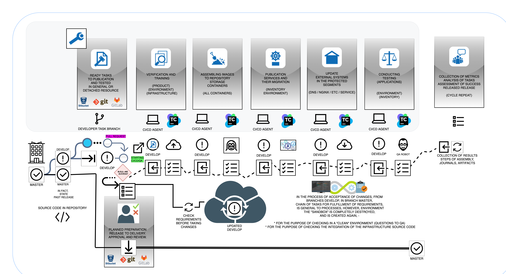

## CI/CD/QA Main Dashboard Default Layout

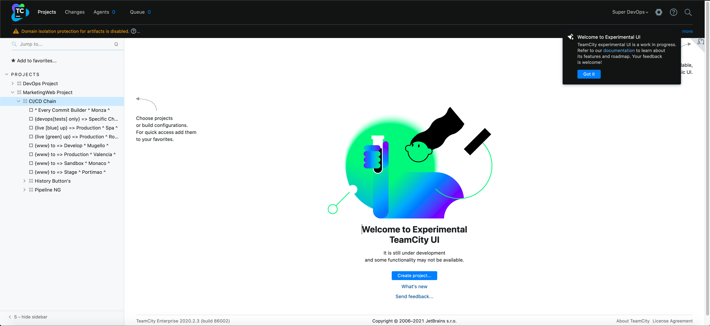

## Services Detector

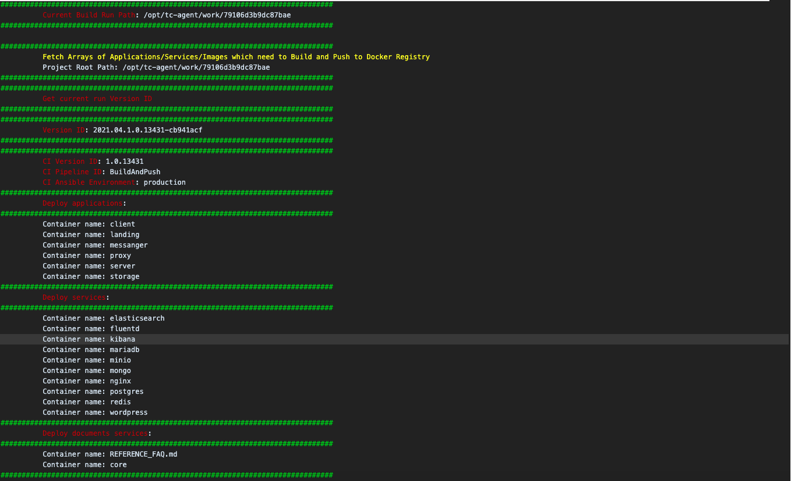

## Service Build Decorator

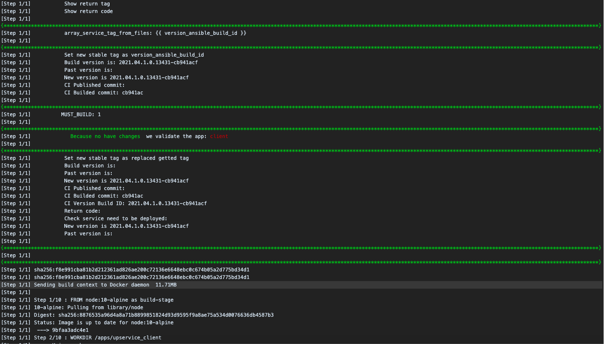

## Built Container Tag


## Registry Built Containers List

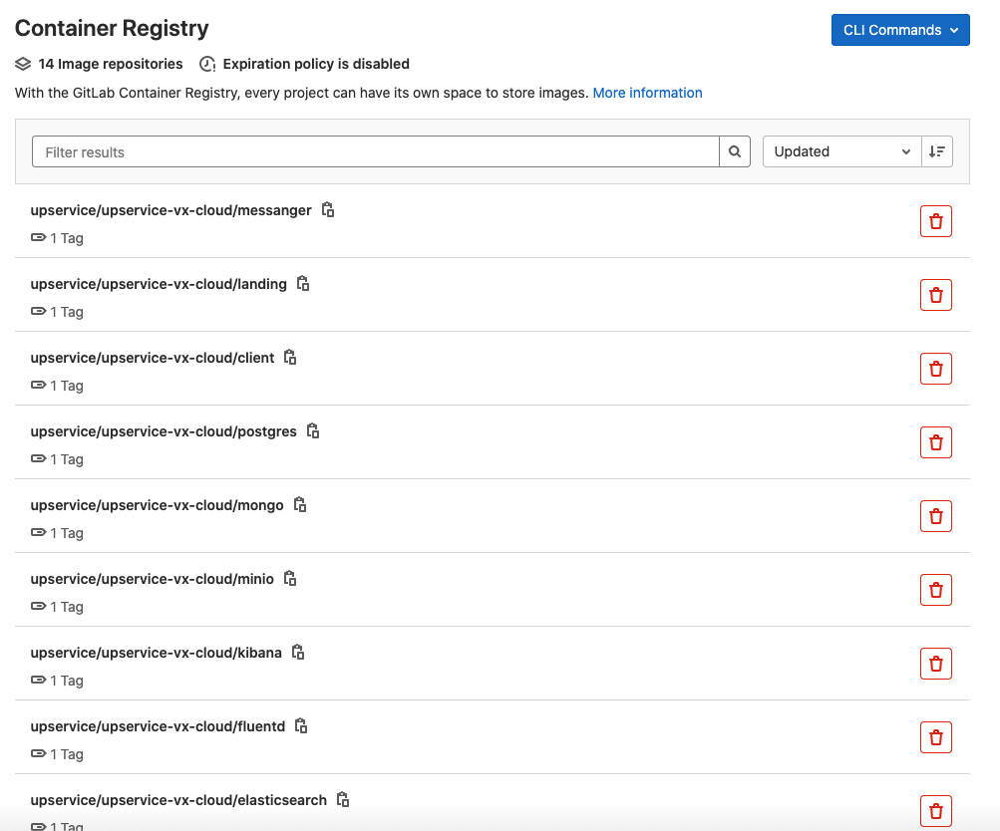

## SSL Tests Results: 07.01.2021

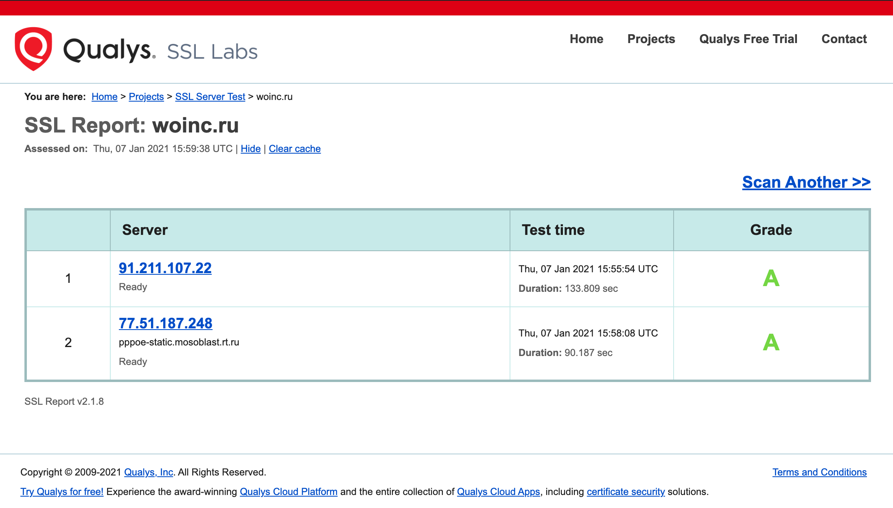

## Repository statements:

```
* Terraform-free Ansible realization of Dynamic Infrastructure development/management/deployment.
* Full IaC support via Ansible Cloud API modules.
* Ready to use, just add your services and declare infrastructure.
* An easy-to-understand solution template provides complete CI/CD/QA.
* Several ways to use multiple roles, zones, clusters, networks.
* K8 & Docker Swarm support - you can have multiple clusters in the same environment.
* A single virtual cloud infrastructure can have multiple virtual environments.
* A simple template to build, boot, develop, deploy, and test your infrastructure.
* Prepare TeamCity to import full process configuration with a simple CI/CD/QA pipeline.
* Network balancer enabled - keepalived, haproxy, nginx, etc.
* Initial PCI DSS compliance support modules.
* Firewall zero-in inside based on Shorewall.
* Much other stuff like rabbitmq/tarantool/redis/etc clusters.
* GlusterFS as shared NFS storage.
* Provides a single point in the development process.
* All configurations are fully generated - for local development and environments.
* You can use various CI/CD tools to use, - TeamCity, Jenkins, Gitlab-CI, etc.
* Storage of embedded docker images is possible in various registries - GitLab, registryv2, nexus, etc.
```

### Markdown constants

    - [-] Feature almost works fine but needs to update/bugfix/extend/refactor now.
    - [+] Feature is currently in development and is planned for the next major release. 
    - [p] Feature that is planned for a future roadmap release in the second major release.
    - [t] Feature is in Testing Branch.
    - [x] Feature is fully implemented, as for the CI/CD Pipeline, 
          if Kubernetes as an example has that flag, 
          which describes that we can create a cluster and deploy in it.
    - [w] Whitepaper page for the feature is ready for RFC, or wip state.
    - [*] Feature is planned to be refactored.
    - [?] On RFC stage.
    - [.] Pre-research and modeling. Checking the status and profit after implementation.
    - [U] The most urgent and most important task to complete.
     
### Ansible Teraforma API Cloud adapters

    - [x] Baremetal (FAKE-API)
    - [*] VMware vCenter/vSphere (API)
    - [-] VMware Cloud Director (API)
    - [x] Alicloud (API)
    - [+] Amazon Web Services (API)
    - [ ] Openstack
    - [ ] Huawei Cloud
    - [x] DigitalOcean
    - [+] Azure
    - [ ] Apache (Citrix) CloudStack
    - [+] Google Compute Engine / Google Cloud Platform (API)
    - [ ] OpenNebula
    - [U] EVE

### Ansible Teraplatforma API Hardware adapters


### Clusters management platform flags are supported by Cluster backend type

    - [x] Docker Swarm
    - [x] Kubernetes
    - [p] Nomad
    - [.] Mesos

### Localhost providers Hyper-Visors for VMs

    - [ ] VMware Workstation/Fusion
    - [ ] Hyper-V
    - [ ] VirtualBox
    - [U] QEMU
    - [ ] Parallels
    - [ ] XEN
    - [U] EVE

### Vortex runs on OS Platforms

    - [x] Linux
    - [x] Mac OS X
    - [-] Windows
    - [-] Android

### Localhost cluster types arch in place

    - [x] Docker by docker-compose
    - [x] Vagrant
    - [p] miniKube

### Vault Storages

    - [x]  The Internal Contract Model Vault, based on Ansible-Vault and a simple interface,
          uses the necessary generic login and password restrictions to manage zero levels, 
          as well as product-specific settings, that can be shared across groups, 
          by inventories, by regions, by sectors, by zones, 
          environments and placements such as ACLs are the same common pieces of the security pie - 
          For example, one command implements a feature for dev[1-3] environments, 
          and has access only through the security breach policy interface,
          only the part of the repository where his credentials,
          which can only perform operations in development environments, after the task is completed, 
          the team leader as an example, who has a higher access level, 
          and can from one pipeline of the commit execution chain to a staging environment,
          with a separate credential for each user level.
            
            Please README in Vx component documentation.

    - [.] Vault (HashiCorp)

### Service Discovery

    - [x] Consul. Multi-DC & Multi-Zone Cloud Consul Cluster,
           with separated/mixed Service Discovery each Zone, Service, Network,
           where ACL is infinitly run with checks to reborn itself cloud warmup bootstrap,
           by platform levels chaining bootstrapping. Mesh accounting, validation and relocation.
           Nginx service discovery full cover by use as upstreams service discovery endpoints,
           which extends with prefix `*.cloud.` each frontend service mesh endpoint.
    - [.] EtcD

### Mesh Mesh Providers

    - [-] Istio
    - [x] Consul
    - [.] LinkerD
    - [.] Envoy

### Domain Name Services

    - [x] CoreDNS.

          * The Main DNS engager Protocol, which is hosted as the interface endpoint, -
          is the ` layout ` of the cloud hosting, use it as a common one on each ```` platform ` in the ` zone `
          for rewriting, filtering, forwarding, redirection for all DNS queries.

          * Contains only rules for processing the recursion path in each DNS request,
          knowns only about DNS zones and server services that respond to them,
          for example, such as K8S Cluster DNS Public VIP Endpoint and Consul Service Discovery DNS Interface,
          which can use network discovery zones services as part of the parent zone. 


    - [x] Bind9 DNS Services Backend.

          * This is a Stub Placement with SOA and records for primary root Domain, -
          ` consul_public_domain ` for each ` sector/zone ` where the parent is ` environment ` father.
          Like redirects to (*.cloud|*.k8|*.swarm), declare itself's and static records,
          VIP and service management tools endpoints, which are uses as pointer where Service Discovery,
          is enabled for service, and static mapping was generated by Ansible Groups.

          * Provides dynamic zone extending and stacking, 
            in geo-mesh networks, detects and announces the nearest endpoints of truth.

    - [-] Kubernetes DNS VIP Endpoint.

          * Used in the same way as Consul, expands the k8 domain with the CoreDNS DMZ Service Discovery Sector, 
          and can forward DNS queries to the Kubernetes Cluster's Internal DNS Service Discovery,
          and represented as ` *.k8.{{ consul_public_domain }} `

    - [.] Docker Swarm DNS VIP Endpoint.

          * Internal Swarm Service Discovery DNS is represented by ` *.swarm.{{ consul_public_domain }} `

## SERVICE NOTE BY ONE PAPER STYLE:

- [PIPELINE EXPLAIN](SERVICE_NOTE.md)
- [CONTRACT EXPLAIN](MAPPER_STRUCTURE.md)

## IaC Flow Design Compare Diagram

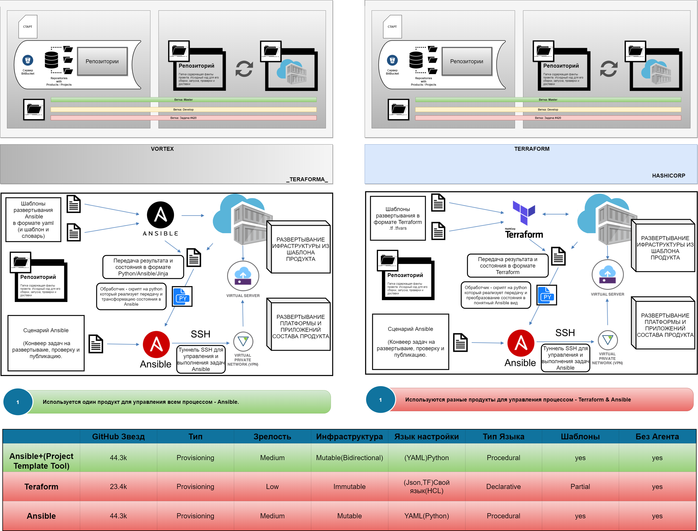

## Declared example standard environments/solutions architecture zone sizes for region placements

- [Vortex Minimal Layout](ansible/CI/repo_images/VortexMinimalTypeNG.png)
- [Vortex Minimal With Service Node](ansible/CI/repo_images/VortexMinimalWithServiceNodeNG.png)
- [Vortex Standard PCI DSS](ansible/CI/repo_images/VortexStandardPCING.png)

  - As default/standard ecosystem layout, in most cases for a simple IT Software Solution, we use:

  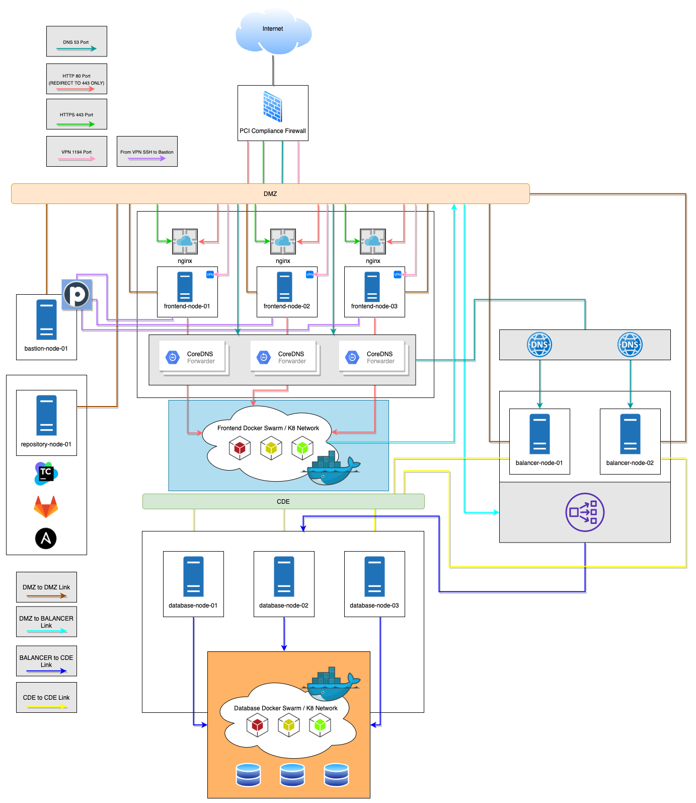

## Geo-replicated mesh cloud model map

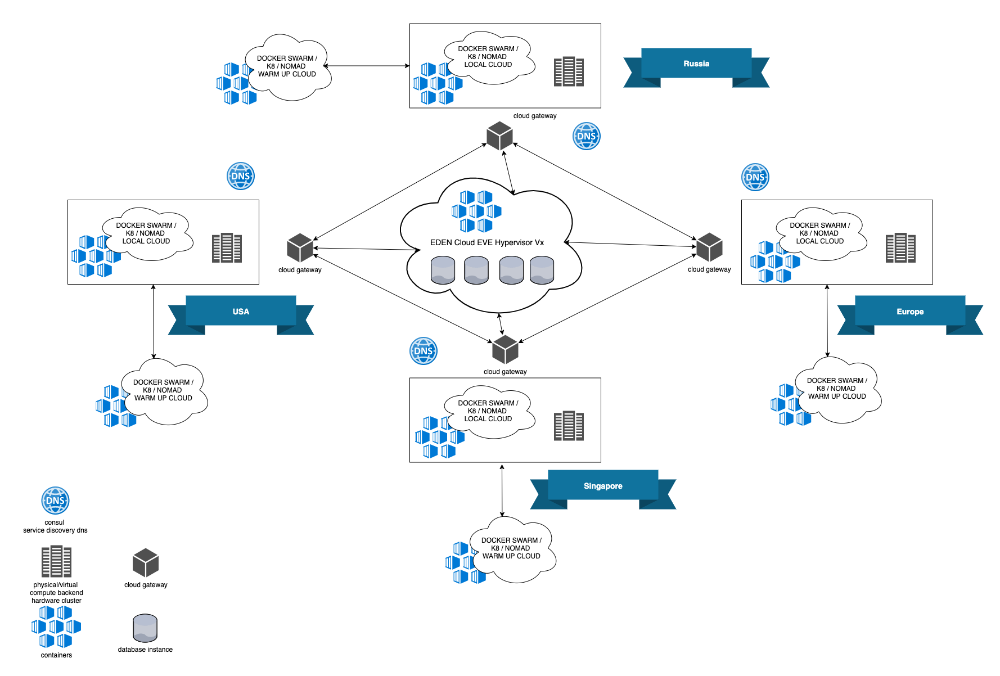

## Mesh QA Stress Test Flow

- [Default QA Running Flow](ansible/CI/repo_images/QA_Short_flow.png)
- [Mesh QA Geo Stress Flow](ansible/CI/repo_images/QA_mesh_stress_run.png)

  - For mesh ecosystems with multiple geo-placements we able to initiate Stress Test Suite
    for any environment from every available inventory.

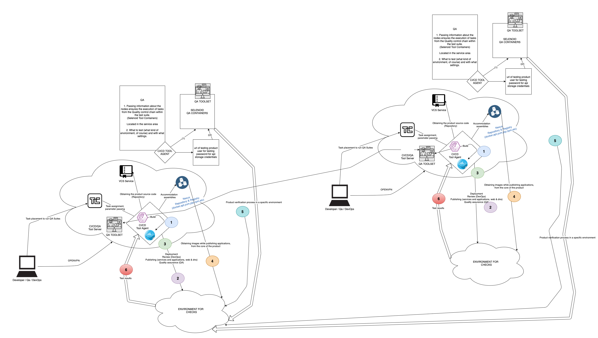

## Readme's links:

- [Ansible](ansible/)
- [Roles](ansible/roles/)
- [Inventories](ansible/inventories/)
- [Group Vars](ansible/group_vars/)
- [CI/CD PCI DSS Usage](ansible/CI/documentation/)
- [How to add a New Service](ansible/CI/documentation/NEW_SERVICE.md)
- [Network Maps](ansible/CI/documentation/PCI/network_maps/)
- [CI/CD Agents Debugger](ansible/!_tests/)
- [API Inventory Ansible Adapters](ansible/!_root_playbooks/)
- [In-Repository Vault Storage](ansible/.files/)

## QA Suites for templating own QA solution

- [QA Example 1 - Payment](PythonQA/history_facts/v.test.selenium.example.payment/)
- [QA Example 2 - Voting](PythonQA/history_facts/v.test.selenium.example.voting/)
- [(WIP) Warrior Way - Guidline](PythonQA/)

## Folders info must to read

- [Dockerfiles](dockerfiles/README.md)
- [Services](services/README.md)

## Two basic types of inventories

Dynamic Inventory (API INVENTORY), called 0z-cloud:

     - Zero Inventory start point of your cloud - a very simple way to work.
     - Zero Inventory - start your cloud upload and check or validate your cloud infrastructure.
     - Contains prefilled/prepared template for creating the instances.
     - Availiable in two types of run - api or baremetal.
     - Contains dict and variables which you want about infrastructure.
     - In API type used as a template.

Target Inventory (GET INVENTORY), resulting inventory:

     - Result of generation the API INVENTORY, contains all needed for Ansible works.
     - Placed in inventories/products/{{ ansible_product }}/{{ ansible_environment }}
     - No stored in repository.

## Principal workflow

### The directory structure for dynamic inventories describes basic call flow

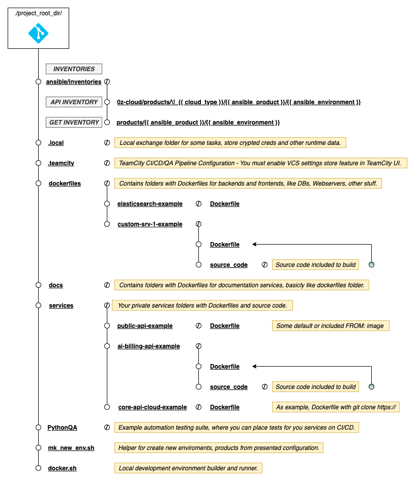

### ZeroCloud configuration flow inside and only on ansible calls

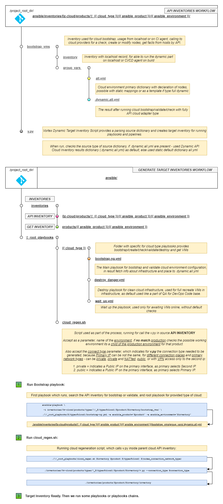

### Working with virtual and cloud environments, bootstrapping and managing

- Basically, we have reorganized and simplified reference runners, represented as `references_*.sh`
  which a year after the start of production testing of the Beta Vortex Prototype don't look as good as they do now.
  To understand how it changes the timeline solution, how it used to work,
  you can see past Vortex beta wrappers here -
  https://github.com/itmo-eve/adam-vortex/tree/master/ansible/scripts/wrappers/init

- Typically, by layout, we have three types of environments, besides the localhost development type -
  `standalone`, `minimal` and `PCI`.
  You can create your own special one and choose options for your time.

- First of all, we create and bootstrap the environment, now it is included in any `reference_*.sh`, in previous versions
  the wrappers for that have been in separated executable wrapper files,
  you can find those old wrappers in https://github.com/itmo-eve/adam-vortex/tree/master/ansible/scripts/wrappers/init
  If you need to, you can do what you want, depending on what you need with the Platform Product and Cloud layout,
  with flexible ways to contract a set of CI / CD streams for the pipeline chain.

- Go to ansible folder in the cloned repository, -

     ```
        cd ./ansible
     ```

  - Try to run the wrapper as an example, -

    ```
      ./reference_iac_stand.sh
    ```

    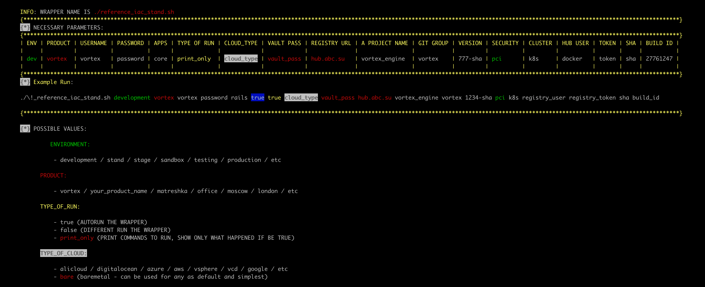

  - TeamCity or another CI/CD/QA running tool just run wrappers to execute some step of pipeline with
    `type_of_run` equals `true`, for local running/debugging/understanding you can run each wrapper
    with value `print_only` in `type_of_run` parameter.
    Please read the configuration in folder `.teamcity` for more understanding.

  - We divide your business product lifecycle management processes into two stages-
  
  - Build and test infrastructure - only if you use the API Cloud Adapter 
    to support a complete dynamic environment.
    
    If you are using the bare-metal adapter, you must create the infrastructure itself and then -
    declare the required node information in a static template.

  - Deploy pipeline:

  - Prepare CI

  - Build and Push Docker images -
    Completely Build your software and necessary backend/database/services images to run your own software.

    ```
      ./reference_builder.sh

    ```

    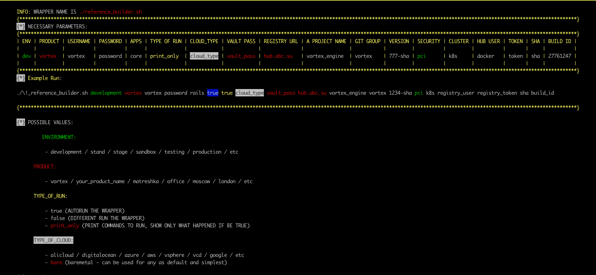

  - Validate Deployment and Deploy - Deploy to Docker Swarm / K8 / Standalone updated manifests, perform DB migrations.

     ```
       ./reference_deployment.sh

     ```

    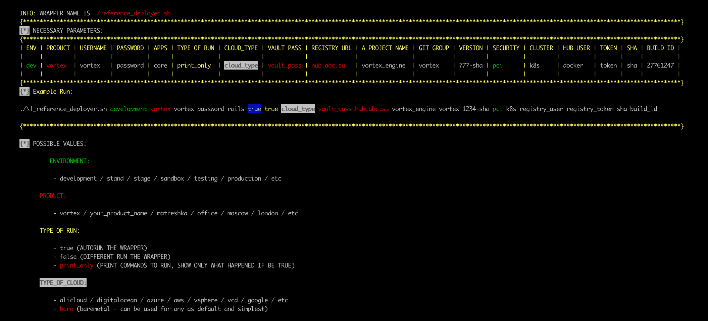

  - Update the Backend DNS & Web-Server (Nginx) configurations - update DNS & webserver configurations
    and check some list of backend services like monitoring, NTP, etc.

     ```
       ./reference_internal.sh

     ```

    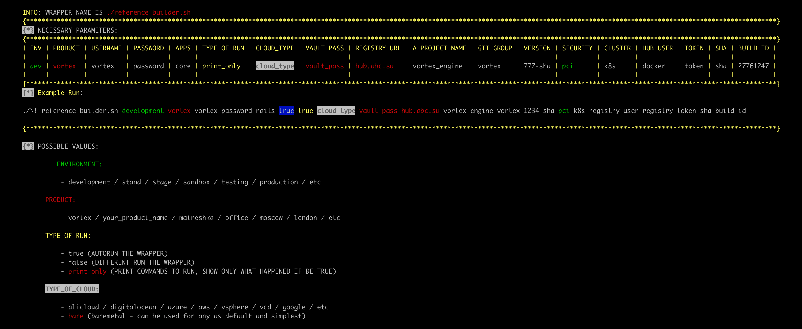

  - Run part of the QA pipeline - run your own QA test suites.
    You must enable this part of the pipeline separately because the feature is disabled by default.

     ```
       ./reference_qa.sh

     ```

    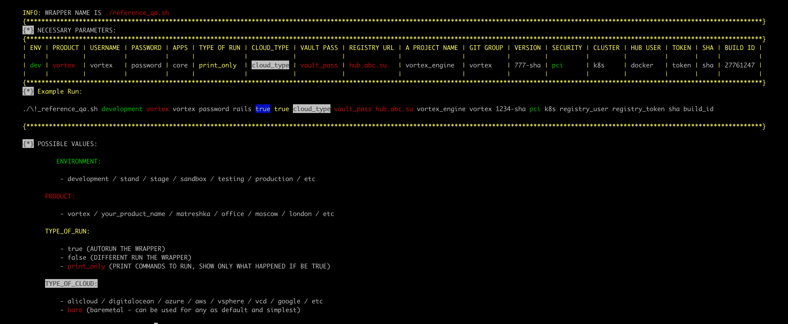

  - You can customize each part of the pipeline, playbooks, and roles.

    ### INTERNAL TEST SUITE DESCRIBE. HOW TO EASY TO START =)

    - By contract in a Vortex flow, the infrastructure root execution point (aka HOME_DIR) -
      not hosted at the root of the entire repository -
      
      Go in and manage your cloud ecosystems, accessible from the `ansible` folder. 

    - All chain flow work with detailed annotations you can see in Vortex Cloud interface 
      when trying to run any `./reference_*.sh` wrapper,
      which calls functions chains for able to instantly start and do develop anything are you want, 
      open easy interface with the way to create, develop, manage, migrate, 
      update or extend your Clouds with runned Services at Scale.
      
      If you run any reference without input the necessary parameters, -
      Vortex Vx exit immanently  with detailed info about this error,
      and also say what to need to do with that.

    - `CI/CD Vortex Chained Pipeline Flows of Suites with Playbooks` designed with `anycloud` model, 
      when not code pass the flow, where `Cloud Vortex Toolset` says - 
      which he needs necessary and by contract are wanted,
      from any input source who want to use any `reference_*.sh`.
      That statement says we can use for run the `Vortex Vx Flow` by any ` CI/CD Tools Solution Product`,
      such as `Jenkins`, `Gitlab-CI`, `TeamCity`, and other capabilities for that software. 
      
      Maybe like `cron`.

    - So, because the interface for talking to platform box are known and we can use any way to run pipe, 
      by the same way, like it will same way to happen in next time on build by any tool,
      then tell me - I can imitate the `Pushing CI Button or CI Triggers`.
      Also, it is a great way to test all features completely, 
      from the same code for preparing an awesome featured release.

    - For running any Shell CI Button, go to `ansible` HOME_DIR =)

    - Try to run something from `./\!_test/[A-Z]*.sh` - all DevOps Shell Imitation CI Buttons
      wrote with the same Pipeline, which itself represents any `CI/CD Tools Product` at any Run. 
      
      Only for development and testing, no play with fire.

    ### PROTOTYPE MODEL BLANK PIPE WITH BUILD RUN AT ANSIBLE TESTS

    - LF EDGE EVE CI dev/test Imitation Button Run in Continuous Development is - 
      
        `./\!_tests/LF_EDGE_EVE_DEVELOPMENT.sh`

   ```

      PS.  
          ALL TESTS SHELL CI BUTTONS HAVE UPPERCASE CHARACTERS.
          AND MAY BE RIGHT WAY WILL BE LOOKING TO INSIDE BEFORE =)

   ```

    - To contribute and fix the use of the complete solution, 
      you must create an `Internal Vault` for your ` Internal Vault Contract` profile.

## Examples of usage the inventories childs -

### One to multiple, where one as a parent:

We have one primary inventory, on some product, some cloud type provider as total, -

            one compute environment, - {{ ansible_environment }} == 'production'

But wants to host multiple virtual environments in the same Datacenter to the same VMs environment

All related environments that we want to add as childs such as virtual ones, look and work on symbolic links.

Let's make, for example, two Childs of Primary - a development and a stage environment,

- Create new folders in the API Cloud Inventory -

    ```
         ./0z-cloud/products/\!_{{ cloud_type }}/{{ ansible_product }}/developemnt/
         ./0z-cloud/products/\!_{{ cloud_type }}/{{ ansible_product }}/stage/
    ```

- Create symbolic links from the dynamic environment of the parent primary cloud to its new childs - 

    ```
         mkdir ./0z-cloud/products/\!_{{ cloud_type }}/{{ ansible_product }}/stage/
         cd ./0z-cloud/products/\!_{{ cloud_type }}/{{ ansible_product }}/stage/
         ln -s ../production/v.py
         ln -s ../production/bootstrap_vms
    ```

- Copy the Target inventory from Parent to New, first of all create target inventory locations -

    ```
         src_environment="production"
         new_environment="stage"
         
         mkdir ./products/{{ ansible_product }}/{{ new_environment }}
         
         old_from_env="./products/{{ ansible_product }}/{{ src_environment }}/*"
         new_env_path="./products/{{ ansible_product }}/{{ new_environment }}/"
         
         cp -R $old_from_env $new_env_path
    ```
    
- Done, now change the domain names and port settings on your new cloud child targets from production environments and deploy! 

### Create a new environment (API and target) cloning some of them as parent:

- From scratch makes a new inventory with examples and a description of why they are needed and what for 

       ./\!_mk_new_env.sh production vortex bare symlink bare setta vortex

- Required inputs to choose how to create a new environment, product, scale,
  or during a migration or upgrade of your infrastructure. 

      1. inventory:    
          
          You must specify the parent inventory that will be the donor for the new inventory. 

      2. product:      
          
          You must specify the parent product that will be the donor for the new cloud configuration. 

      3. type cloud:   
          
          You must specify the type of parent cloud, for example {vsphere / alicloud / bare / etc}. 

      4. run type:     
      
          Type of spawning the scratcher, from other repo, ways for choice {clone/symlink}.

      5. type cloud:   
      
          You must specify the type of target cloud, for example like - 
          
          { aws / azure / do / vcd / vsphere / yandex / gcp / alicloud / bare / etc }.

      6. inventory:    
          
          You must specify the target inventory, -
          which is the result of the new inventory for the cloud location. 

      7. product:      
          
          You must specify the target product, which is the result for the new cloud location. 
          
### Code Cloud Liquid Coin Database 

* Localhost simple web integrated API Client overview:


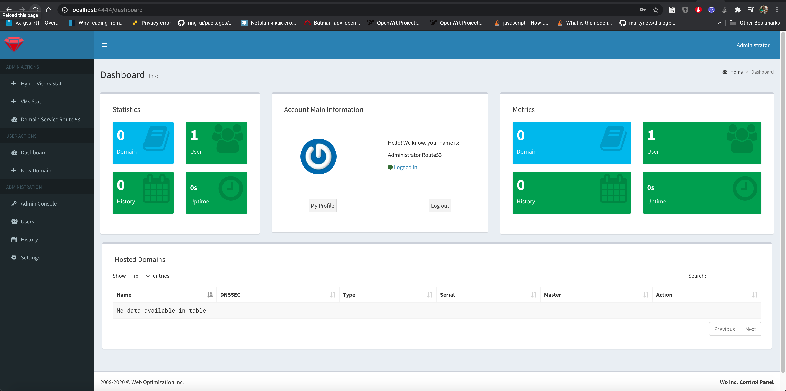
